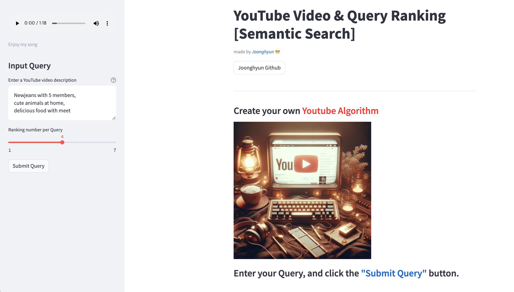

# <center> Youtube Semantic Search </center>

###### <center> CLIP모델 PEFT을 통한 YouTube 영상 시맨틱 검색 </center>

## Intro

사용자가 입력한 텍스트 쿼리를 임베딩으로 만들고 미리 크롤링을 통해서 유튜브 영상들을 임베딩으로 만듭니다. 이때, 영상을 임베딩으로 만들 때 CLIP(이미지 인코더)과 XCLIP(비디오 인코더)를 사용하였습니다. 또한, domain adaptation 하게 만들기 위해서 PEFT 중 LoRA를 적용하여 모델 아키텍쳐를 구성하였고, contrastive loss로 유튜브 image-text pair 데이터를 통해 학습시켰습니다. 이렇게 생성된 이미지(비디오) 임베딩들을 vector DB(Qdrant)에 저장하였고, 사용자가 문장으로 검색하더라도 의미적으로 유사한 영상을 찾을 수 있게 시스템을 구축하여 streamlit으로 배포하였습니다.

**아래 streamlit을 통한 데모버전을 체험해보세요!**


## [streamlit 데모버전](https://youtube-rank.streamlit.app/)


---

# <center> Training Process </center>


**모델 아키텍쳐**
base model은 🤗 Transformers의 CLIP,XCLIP을 사용하여,
lora.py를 이용해서 base model에 module을 추가한 모델 아키텍쳐를 사용해서 Parameter efficient하게 파인튜닝하였습니다. 

**Dataset & Loss**
youtube Image-text 데이터셋을 통해 contrastive learning을 하기 위해서 필요한 positive pair를 만드는데, 이미지는 Augementation, text는 dropout을 통해서  만들었습니다. (SimCLR,SimCSE 참조)


### Installation & How to Use


```bash
git clone https://github.com/Blackeyes0u0/Youtube_Semantic_Search.git
cd Youtube-Semantic-Search
pip install -r requirements.txt
cd peft_train
bash script.sh
```

### File Structure

```
Youtube-Semantic-Search
├── README.md
│── streamlit-app.py    # streamlit file
│── requirements.txt
│
├── Data
│  └── Youtube_thumbnails
│       ├── images
│       └── metadata.csv
│
├── peft_train
│  ├── lora.py          # LoRA module 적용
│  ├── Loss.py          # contrastivle loss
│  ├── main2.py 
│  ├── scheduler.py     # consie anealing
│  ├── script.sh        # 학습 실행 파일
│  ├── train.py
│  └── validation.py
│
├── Qdrant
│  ├── vector_upload.py # Qdrant Vector DB에 업로드
│  ├── crawl2emb.py     # video,vision,text encoder로 임베딩
│  └── crawling         # DB로 만들 비디오 크롤링
│     ├── get_shorts.py
│     └── get_videos.py
│
│── README_image # 첨부한 이미지
└── streamlit.gif # streamlit 동작 gif
```


## Model Architecture



Model & Loss 설명: https://velog.io/@blackeyes0u0/youtube-CLIP-LoRA-SimCSE-%EA%B2%B0%EA%B3%BC


위 모델 아키텍쳐를 보면 Latent space 상에서 이미지 임베딩과 텍스트 임베딩의 거리를 가깝게 하는것을 alignment, 멀게하면서 embedding space의 singular spectrum을 평평하게 하는것을 Uniformity라고 정의하였습니다. 아래는 trainable한 LoRA 모듈의 구조입니다.


LoRA 논문 리뷰 : https://velog.io/@blackeyes0u0/%EB%85%BC%EB%AC%B8%EB%A6%AC%EB%B7%B0-LoRA-Low-Rank-Adaptation-of-Large-Language-Models


이렇게 학습된 파일은 **huggingface space에 데모 버전을 올려놓았습니다.**

### [huggingface space demo](https://huggingface.co/Soran/youtube_CLIP_LoRA_SimCSE)

---

# Vector DB & Deploy


vector DB는 Qdrant를 사용하여 관리하였고, streamlit 사이트를 이용해서 배포하였습니다.


##### Contributing

언제나 기여를 환영합니다! 개선 사항이나 새로운 기능이 포함된 pull&requests 부탁드려요!

제 글에 관심있으신 분은 [블로그](https://velog.io/@blackeyes0u0)에 놀러와주세요!

<center>


#### <center> created by JoongHyun Shin </center>

</center>


## Reference

##### paper References
- CLIP : https://arxiv.org/abs/2103.00020
- LoRA : https://arxiv.org/abs/2106.09685
- SimCSE : https://arxiv.org/abs/2104.08821
- SimCLR : https://arxiv.org/abs/2002.05709
- XCLIP : https://arxiv.org/abs/2208.02816

##### Blog References
- Qdrant : https://qdrant.tech/documentation/overview/
- LoRA Offical github : https://github.com/microsoft/LoRA
- torchviz : https://github.com/szagoruyko/pytorchviz