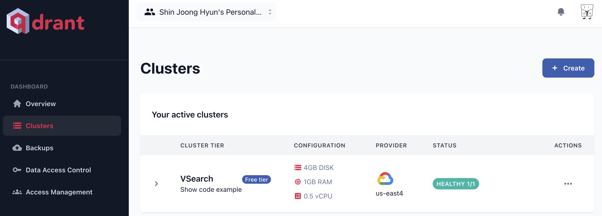

---
---
---

# <center> Youtube Semantic Search </center>

---

<center>


</center>

#### <center> JoongHyun Shin </center>

<!-- <br> -->
## 프로젝트 소개

사용자가 입력한 텍스트 쿼리를 임베딩으로 만들고 미리 크롤링을 통해서 유튜브 영상들을 임베딩으로 만듭니다. 이때, 영상을 임베딩으로 만들 때 CLIP(이미지 인코더)과 XCLIP(비디오 인코더)를 사용하였습니다. 또한, domain adaptation 하게 만들기 위해서 PEFT 중 LoRA를 적용하여 모델 아키텍쳐를 구성하였고, contrastive loss로 유튜브 image-text pair 데이터를 통해 학습시켰습니다. 이렇게 생성된 이미지(비디오) 임베딩들을 vector DB(Qdrant)에 저장하였고, 사용자가 문장으로 검색하더라도 의미적으로 유사한 영상을 찾을 수 있게 시스템을 구축하여 streamlit으로 배포하였습니다.

**아래 streamlit을 통한 데모버전을 체험해보세요!**


## [streamlit 데모버전](https://youtube-rank.streamlit.app/)


---

# Train

base model은 🤗 Transformers의 CLIP,XCLIP을 사용하였습니다.

### Installation 


```bash
pip install transformers
pip install peft
pip install loralib
pip install wandb
```

## File Structure

```
Youtube-Semantic-Search
├── README.md
│── streamlit-app.py
│── requirements.txt
│
├── Data
│  ├── VQA
│  │
│  └── Youtube_thumbnails
│       ├── images
│       └── metadata.csv
│
├── train
│  ├── bluebird
│  ├── chalk
│  ├── cli-spinner
│  ├── meow
│  └── object-assign
│
├── Qdrant
│  ├── qdrant_upload.py
│  ├── chalk
│  ├── cli-spinner
│  ├── meow
│  └── crawling
│     ├── bluebird
│     ├── chalk
│     ├── cli-spinner
│     └── object-assign
│
│── streamlit-app.py
│── package.json
└── tree.js
```


# 1. Datasets & DataLoader

<!--  -->

#### youtube thumbnails data

$I^{(i)}$ : youtube thumbnail Image data $i$
$T^{(i)}$ : youtube Title data $i$

<!-- #### Example 

$I^{(i)}$ : 

$T^{(i)}$ : **Cutest Cats Compilation 2017 | Best Cute Cat Videos Ever** -->


---
# 2. Model & Loss Architecture

<!-- 
 -->

<!--  -->


위 모델 아키텍쳐를 보면 Latent space 상에서 이미지 임베딩과 텍스트 임베딩의 거리를 가깝게 하는것을 alignment, 멀게하는것을 Uniform라고 정의하였습니다.

### [model 설명](https://velog.io/@blackeyes0u0/youtube-CLIP-LoRA-SimCSE-%EA%B2%B0%EA%B3%BC)

### [LoRA 논문 리뷰](https://velog.io/@blackeyes0u0/%EB%85%BC%EB%AC%B8%EB%A6%AC%EB%B7%B0-LoRA-Low-Rank-Adaptation-of-Large-Language-Models)


---


# 3. Objective function

$$
h_i = f(x_i)
$$


$$ 
\mathcal{L_i} = - \log \frac{e^{sim(h_i,h_i^+) / \tau}}{\sum_je^{sim(h_i,h_j)/ \tau}}
$$


$i$ 번째 데이터와 $N$개의 batch_size pair 대해서 위와 같이 표현 할 수있다. 

$h_i$는 데이터의 임베딩에 해당하고, $z_i$는 각 데이터에 가한 augmentation에 해당한다. $\tau$는 하이퍼파라미터 temperature값이다.


<!--  -->

<!--  -->

$$
\mathcal{L} = \sum_{i=1}^{N} log \exp^ {-\frac{1}{\tau}  sim(h_i,h_i^+)} (Alignment)
$$

$$
+\sum_{i=1}^{N} log \sum_{j=1 }^{N} \exp^{\frac{1}{\tau} sim(h_i,h_j)} (Uniform)
$$


여기서 나오는 sim은 similarity의 약자이고, cosine similarity를 사용하였습니다. 이렇게 학습된 파일은 **huggingface space에 데모 버전을 올려놓았습니다. 아래 클릭**

### [Click](https://huggingface.co/Soran/youtube_CLIP_LoRA_SimCSE)

---

# Vector DB & Deploy

vector DB는 Qdrant를 사용하여 관리하였고, streamlit 사이트를 이용해서 배포하였습니다.


---

>기여: 다른 사람들이 이 프로젝트에 기여할 수 있는 방법을 설명하세요. 이는 버그 리포트, 기능 제안, 코드 수정 등을 포함할 수 있습니다.


>추가 정보: 프로젝트와 관련된 추가 정보 또는 리소스를 제공할 수 있습니다. 이는 관련 논문, 블로그 포스트, 데모 영상 등을 포함할 수 있습니다

## Reference

##### paper References
- CLIP : https://arxiv.org/abs/2103.00020
- LoRA : https://arxiv.org/abs/2106.09685
- SimCSE : https://arxiv.org/abs/2104.08821
- SimCLR : https://arxiv.org/abs/2002.05709
- XCLIP : https://arxiv.org/abs/2208.02816

##### Blog References
- Qdrant : https://qdrant.tech/documentation/overview/
- LoRA Offical github : https://github.com/microsoft/LoRA
- torchviz : https://github.com/szagoruyko/pytorchviz