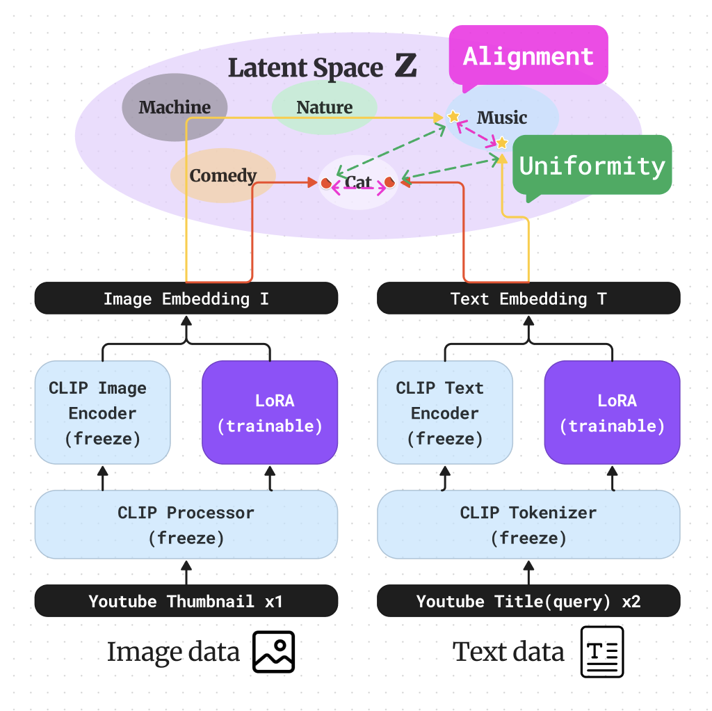

# <center>YouTube Semantic Search</center>

###### <center>Explore YouTube Videos Semantically with CLIP adapted LoRA </center>

## Introduction

This project enables semantic search for YouTube videos by converting text queries and video content into embeddings. We use CLIP (for image encoding) and XCLIP (for video encoding) to transform the videos into embeddings. To adapt the model to the specific domain, we apply LoRA (a method from PEFT) to the architecture and train it using contrastive loss with YouTube image-text pair data. The embeddings are stored in a vector database (Qdrant), allowing users to search for videos semantically through text queries. The system is deployed via Streamlit for easy access and interaction.

**Try the demo version through Streamlit!**


## [streamlit demo version](https://youtube-rank.streamlit.app/)


---

# <center> Training Process </center>


**Model Architecture**
We utilize the base models from 🤗 Transformers, CLIP, and XCLIP, and enhance them with a module from lora.py for a parameter-efficient fine-tuning approach.

**Dataset & Loss**
The YouTube Image-text dataset was employed to create positive pairs for contrastive learning. Image augmentation and text dropout techniques were used to generate varied training samples, inspired by SimCLR and SimCSE.

### Installation & Usage


```bash
git clone https://github.com/Blackeyes0u0/Youtube_Semantic_Search.git
cd Youtube-Semantic-Search
pip install -r requirements.txt
cd peft_train
bash script.sh
```

### File Structure

```
Youtube-Semantic-Search/
├── README.md
├── README_kor.md           # README 한국말 버전
├── streamlit-app.py        # Streamlit application
├── requirements.txt
├── Data/
│   └── Youtube_thumbnails/
│       ├── images/
│       └── metadata.csv
├── peft_train/
│   ├── lora.py             # LoRA module
│   ├── Loss.py             # Contrastive loss
│   ├── main2.py
│   ├── scheduler.py        # Cosine annealing
│   ├── script.sh           # Training script
│   ├── train.py
│   └── validation.py
├── Qdrant/
│   ├── vector_upload.py    # Upload embeddings to Qdrant Vector DB
│   ├── crawl2emb.py        # Convert videos to embeddings
│   └── crawling/           # Video crawling for DB
│       ├── get_shorts.py
│       └── get_videos.py
├── README_image/           # Images for README
└── streamlit.gif           # GIF demonstrating Streamlit app

```


## Model Architecture Overview



Learn more about the model and loss : https://velog.io/@blackeyes0u0/youtube-CLIP-LoRA-SimCSE-%EA%B2%B0%EA%B3%BC

The architecture aligns image and text embeddings in the latent space while ensuring uniformity across the embedding spectrum. This approach is visualized below, alongside the trainable LoRA module structure.


LoRA paper review : https://velog.io/@blackeyes0u0/%EB%85%BC%EB%AC%B8%EB%A6%AC%EB%B7%B0-LoRA-Low-Rank-Adaptation-of-Large-Language-Models


These learned files on **huggingface space**

#### [huggingface space trained model](https://huggingface.co/Soran/youtube_CLIP_LoRA_SimCSE)

---

# Vector Database & Deployment


We utilize Qdrant for managing the vector database and deploy the interface using Streamlit.


##### Contributing

We welcome contributions! You can help by reporting bugs, suggesting features, or contributing to code. Here's how you can get involved:

Bug Reports & Feature Suggestions: Share your findings and ideas on GitHub issues.
Code Contributions: Submit pull requests with improvements or new features.

**For more details, check out my [Blog](https://velog.io/@blackeyes0u0)**

<center>


#### <center> created by JoongHyun Shin </center>

</center>


## References

##### Papers
- CLIP : https://arxiv.org/abs/2103.00020
- LoRA : https://arxiv.org/abs/2106.09685
- SimCSE : https://arxiv.org/abs/2104.08821
- SimCLR : https://arxiv.org/abs/2002.05709
- XCLIP : https://arxiv.org/abs/2208.02816

##### Blogs & Documentation
- Qdrant : https://qdrant.tech/documentation/overview/
- LoRA Offical github : https://github.com/microsoft/LoRA
- torchviz : https://github.com/szagoruyko/pytorchviz